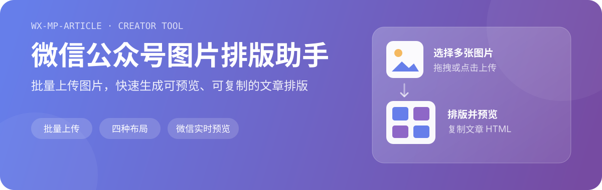

<p align="center">
  
</p>

<p align="center">
  <a href="https://github.com/cooker/wx-mp-article/actions"></a>
  
  
  
</p>

一个为微信公众号内容创作者准备的图片工作台。批量选择图片后，你可以上传到自己的 GitHub 图床，在四种布局间切换，实时检查微信文章效果，并复制生成的 HTML。

## 功能一览

- **批量图片处理**：支持点击选择和拖拽上传，一次处理多张图片。
- **四种排版模式**：网格、瀑布流、马赛克与轮播。
- **微信公众号预览**：在编辑过程中即时查看文章中的展示效果。
- **GitHub 图床**：上传到用户自行配置的仓库，并生成 jsDelivr CDN 链接。
- **HTML 输出**：生成并复制适合继续编辑或粘贴使用的文章 HTML。
- **多端运行**：可作为 Chrome 扩展、Web 应用或 Electron 桌面应用运行。

## 工作流程

```text
选择图片 → 配置 GitHub 仓库 → 上传并生成 CDN 链接 → 选择布局 → 预览并复制 HTML
```

GitHub 仓库配置和访问令牌保存在浏览器本地。只有在用户主动上传图片时，应用才会向 `api.github.com` 发送所选图片和令牌。

## 快速开始

### Chrome 扩展

1. 安装依赖并构建扩展包：

   ```bash
   pnpm install
   pnpm build:extension
   ```

2. 构建完成后会生成 `wx-mp-article-extension.zip`。
3. 本地调试时，打开 `chrome://extensions`，启用开发者模式，并加载解压后的 `dist` 目录。
4. 点击扩展图标，会在独立标签页中打开完整排版工作台。

### Web 开发

```bash
pnpm install
pnpm dev
```

开发服务器默认运行在 `http://localhost:3000`。

生产构建与本地预览：

```bash
pnpm build
pnpm preview
```

### Electron 桌面应用

```bash
# 开发运行
pnpm electron:dev

# 构建当前平台安装包
pnpm electron:build
```

平台专用构建命令：

```bash
pnpm electron:build:mac
pnpm electron:build:win
```

产物位于 `dist-electron/`。

## GitHub 图床配置

| 字段 | 说明 | 示例 |
| --- | --- | --- |
| Owner | GitHub 用户名或组织名 | `bucketio` |
| Repo | 图片仓库；支持随机仓库语法 | `img[0-19]` |
| Branch | 上传目标分支 | `main` |
| Path prefix | 仓库内目录，默认按日期生成 | `2026/08/02` |
| Token | 具有目标仓库写入权限的 GitHub Token | 仅保存在本地 |

随机仓库语法 `img[0-19]` 会在 `img0` 到 `img19` 中随机选择一个仓库，适合分散存储图片。

> 请为 Token 配置最小必要权限，并只授权需要上传图片的仓库。

## 项目结构

```text
wx-mp-article/
├── public/                 # Chrome 扩展清单、后台脚本与图标
├── src/
│   ├── components/         # 上传、布局、配置与微信预览组件
│   ├── composables/        # GitHub 上传、HTML 模板等业务逻辑
│   ├── styles/             # 组件样式
│   ├── App.vue
│   └── main.js
├── electron/               # Electron 主进程
├── vite.config.js
└── package.json
```

## 技术栈

- [Vue 3](https://vuejs.org/) Composition API
- [Vite](https://vite.dev/)
- Chrome Extensions Manifest V3
- [Electron](https://www.electronjs.org/) 与 electron-builder

## 隐私与安全

- 不包含广告、分析 SDK 或用户追踪。
- GitHub 配置和 Token 存储在用户设备本地。
- 图片仅在用户主动操作时上传到其指定的 GitHub 仓库。
- Chrome 扩展仅声明 `https://api.github.com/*` 主机权限。

完整说明见 [隐私政策](./public/privacy.html)。

## 部署

仓库包含 GitHub Pages 工作流。启用仓库的 **Settings → Pages → GitHub Actions** 后，推送到 `main` 或 `master` 即可触发部署。更多说明见 [DEPLOY.md](./DEPLOY.md)。

## License

MIT
